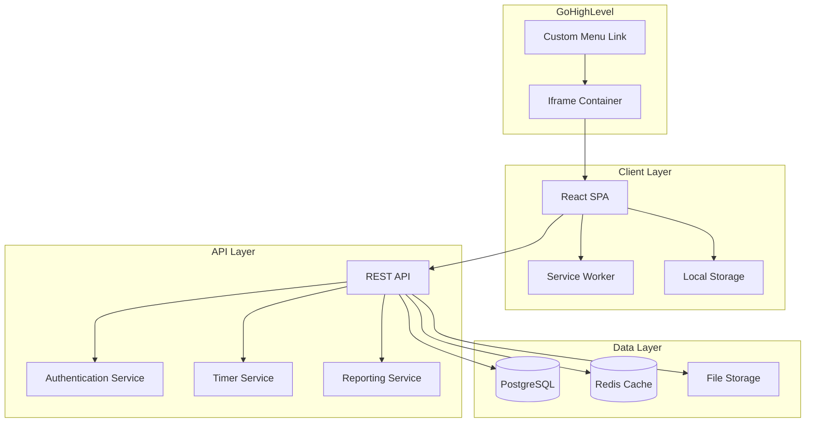

# Design Document

## Overview

The web-based time tracker will be built as a modern single-page application (SPA) optimized for iframe embedding within GoHighLevel. The architecture follows a client-server model with offline-first capabilities, using a RESTful API backend and a responsive React frontend. The design prioritizes iframe compatibility, multi-user support, and extensibility for future platform expansion.

## Architecture

### High-Level Architecture



### Technology Stack

**Frontend:**
- React 18 with TypeScript for type safety and component reusability
- Tailwind CSS for responsive design and iframe-friendly styling
- React Query for API state management and offline caching
- Zustand for local state management
- Service Worker for offline functionality

**Backend:**
- Node.js with Express.js for the REST API
- PostgreSQL for persistent data storage
- Redis for session management and real-time features
- JWT for authentication
- Socket.io for real-time timer updates (with iframe fallbacks)

**Infrastructure:**
- Docker containers for deployment
- HTTPS/SSL for secure iframe embedding
- CDN for static asset delivery

## Components and Interfaces

### Frontend Components

#### Core Components
1. **TimerWidget**: Main timer interface with start/stop/pause functionality
2. **ProjectSelector**: Dropdown for selecting/creating projects
3. **TimeEntryList**: Display and management of time entries
4. **UserAuth**: Login/logout and user switching
5. **ReportDashboard**: Time reporting and analytics
6. **OfflineIndicator**: Shows connection status

#### Layout Components
1. **IframeLayout**: Optimized layout for iframe constraints
2. **ResponsiveContainer**: Handles different viewport sizes
3. **NavigationTabs**: Tab-based navigation for different views

### API Interfaces

#### Authentication Endpoints
```typescript
POST /api/auth/login
POST /api/auth/logout
POST /api/auth/refresh
GET /api/auth/me
```

#### Timer Endpoints
```typescript
POST /api/timers/start
POST /api/timers/stop
GET /api/timers/active
PUT /api/timers/:id
DELETE /api/timers/:id
```

#### Time Entry Endpoints
```typescript
GET /api/entries
POST /api/entries
PUT /api/entries/:id
DELETE /api/entries/:id
GET /api/entries/export
```

#### Project Endpoints
```typescript
GET /api/projects
POST /api/projects
PUT /api/projects/:id
DELETE /api/projects/:id
```

## Data Models

### User Model
```typescript
interface User {
  id: string;
  email: string;
  name: string;
  organizationId: string;
  role: 'admin' | 'user';
  preferences: UserPreferences;
  createdAt: Date;
  updatedAt: Date;
}

interface UserPreferences {
  defaultProject?: string;
  timeFormat: '12h' | '24h';
  weekStartDay: number;
  notifications: boolean;
}
```

### Project Model
```typescript
interface Project {
  id: string;
  name: string;
  color: string;
  description?: string;
  userId: string;
  isActive: boolean;
  createdAt: Date;
  updatedAt: Date;
}
```

### TimeEntry Model
```typescript
interface TimeEntry {
  id: string;
  userId: string;
  projectId: string;
  description: string;
  startTime: Date;
  endTime?: Date;
  duration: number; // in seconds
  isRunning: boolean;
  tags: string[];
  createdAt: Date;
  updatedAt: Date;
}
```

### Timer State Model
```typescript
interface TimerState {
  isRunning: boolean;
  currentEntry?: TimeEntry;
  startTime?: Date;
  elapsedTime: number;
  lastSync: Date;
}
```

## Iframe Compatibility Strategy

### Security and Restrictions
1. **Content Security Policy**: Configure CSP headers to allow iframe embedding from GoHighLevel domains
2. **X-Frame-Options**: Set to SAMEORIGIN or specific allowed origins
3. **HTTPS Enforcement**: Ensure all communication is over HTTPS for iframe security
4. **Postmessage API**: Use for secure communication with parent frame when needed

### UI Adaptations
1. **Compact Layout**: Design for minimal vertical space (300-400px height)
2. **No Popups**: Avoid modal dialogs that might be blocked in iframes
3. **Inline Editing**: Use inline forms instead of separate pages
4. **Responsive Breakpoints**: Optimize for common iframe sizes

### Fallback Mechanisms
1. **WebSocket Fallbacks**: Use polling if WebSocket connections fail in iframe
2. **Local Storage**: Primary storage with server sync as backup
3. **Simplified Navigation**: Single-page design with tab-based navigation

## Error Handling

### Client-Side Error Handling
1. **Network Errors**: Graceful degradation to offline mode
2. **Authentication Errors**: Automatic token refresh with fallback to re-login
3. **Validation Errors**: Inline form validation with clear error messages
4. **Timer Conflicts**: Handle multiple timer instances across tabs/devices

### Server-Side Error Handling
1. **Rate Limiting**: Implement API rate limiting with clear error responses
2. **Database Errors**: Transaction rollbacks and data consistency checks
3. **Authentication Failures**: Secure error messages without information leakage
4. **Concurrent Updates**: Optimistic locking for time entry modifications

### Error Recovery
1. **Automatic Retry**: Exponential backoff for failed API requests
2. **Data Sync**: Conflict resolution for offline/online data synchronization
3. **State Recovery**: Restore timer state after browser crashes or refreshes

## Testing Strategy

### Unit Testing
1. **Component Testing**: React Testing Library for UI components
2. **Service Testing**: Jest for business logic and API services
3. **Utility Testing**: Pure function testing for time calculations
4. **Mock Testing**: Mock external dependencies and API calls

### Integration Testing
1. **API Testing**: Supertest for REST endpoint testing
2. **Database Testing**: Test database operations with test containers
3. **Authentication Testing**: End-to-end auth flow testing
4. **Timer Logic Testing**: Test timer accuracy and state management

### End-to-End Testing
1. **Iframe Testing**: Playwright tests within iframe contexts
2. **Multi-User Testing**: Concurrent user scenarios
3. **Offline Testing**: Service worker and offline functionality
4. **Cross-Browser Testing**: Chrome, Firefox, Safari compatibility

### Performance Testing
1. **Load Testing**: API performance under concurrent users
2. **Memory Testing**: Client-side memory usage monitoring
3. **Network Testing**: Offline/online transition testing
4. **Timer Accuracy**: Long-running timer precision testing

## Security Considerations

### Authentication & Authorization
1. **JWT Tokens**: Short-lived access tokens with refresh token rotation
2. **Role-Based Access**: User and admin role separation
3. **Session Management**: Secure session handling with Redis
4. **Multi-Factor Authentication**: Optional 2FA for enhanced security

### Data Protection
1. **Encryption**: Encrypt sensitive data at rest and in transit
2. **Input Validation**: Comprehensive server-side validation
3. **SQL Injection Prevention**: Parameterized queries and ORM usage
4. **XSS Protection**: Content sanitization and CSP headers

### Iframe Security
1. **Origin Validation**: Verify iframe parent origin
2. **Sandboxing**: Appropriate iframe sandbox attributes
3. **Communication Security**: Secure postMessage implementation
4. **Resource Isolation**: Prevent resource access from parent frame

## Scalability and Performance

### Frontend Performance
1. **Code Splitting**: Lazy load components and routes
2. **Caching Strategy**: Aggressive caching of static assets
3. **Bundle Optimization**: Tree shaking and minification
4. **Virtual Scrolling**: For large time entry lists

### Backend Performance
1. **Database Indexing**: Optimize queries with proper indexes
2. **Caching Layer**: Redis for frequently accessed data
3. **Connection Pooling**: Efficient database connection management
4. **API Pagination**: Limit response sizes with pagination

### Monitoring and Observability
1. **Error Tracking**: Sentry for error monitoring and alerting
2. **Performance Monitoring**: Real User Monitoring (RUM) for client performance
3. **API Monitoring**: Response time and error rate tracking
4. **Usage Analytics**: Track feature usage and user behavior patterns